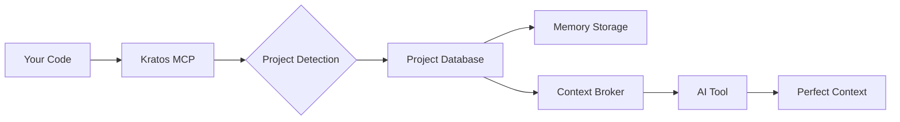

[](https://mseep.ai/app/ceorkm-kratos-mcp)

<div align="center">
  
# 🏛️ Kratos MCP

### Memory System for AI Coding Tools

[](https://www.npmjs.com/package/kratos-mcp)
[](https://opensource.org/licenses/MIT)
[](https://modelcontextprotocol.io)
[](https://www.typescriptlang.org/)

**Never explain your codebase again. Let AI remember everything.**

[Installation](#-installation) • [Quick Start](#-quick-start) • [Features](#-features) • [Documentation](#-documentation) • [Contributing](#-contributing)

</div>

---

## 🎯 Why Kratos?

After building 30+ production apps with AI, we discovered a critical problem: **AI tools forget everything between sessions**. You explain your architecture, your patterns, your decisions—and tomorrow, you explain it all again.

Kratos MCP solves this with the **Four Pillars Framework**—a battle-tested system that gives AI perfect memory of your project.

## ✨ Features

<table>
<tr>
<td width="50%">

### 🔒 **100% Project Isolation**
Each project gets its own SQLite database. No cross-contamination. Ever.

</td>
<td width="50%">

### 🎯 **95.8% Context Accuracy**
Smart retrieval engine that knows exactly what memories matter for your current task.

</td>
</tr>
<tr>
<td width="50%">

### ⚡ **Zero Configuration**
Auto-detects projects via git, package.json, or directory structure. Just install and code.

</td>
<td width="50%">

### 🌍 **Universal Protocol**
Works with Claude, Cursor, Windsurf, Continue—any MCP-compatible tool.

</td>
</tr>
</table>

## 🚀 Installation

```bash
# Install globally
npm install -g kratos-mcp

# Or run directly with npx (no installation required)
npx kratos-mcp

# Or install as a dependency
npm install kratos-mcp
```

## 🎬 Quick Start

### 1️⃣ Configure Your AI Tool

<details>
<summary><b>Claude Desktop</b></summary>

Add to your Claude Desktop config file:
- **macOS**: `~/Library/Application Support/Claude/claude_desktop_config.json`
- **Windows**: `%APPDATA%\Claude\claude_desktop_config.json`
- **Linux**: `~/.config/claude/claude_desktop_config.json`

```json
{
  "mcpServers": {
    "kratos": {
      "command": "npx",
      "args": ["--yes", "kratos-mcp@latest"]
    }
  }
}
```

Or if you have it installed globally:
```json
{
  "mcpServers": {
    "kratos": {
      "command": "kratos-mcp",
      "args": []
    }
  }
}
```
</details>

<details>
<summary><b>Claude Code (Anthropic's VSCode Extension)</b></summary>

Run this command in your terminal:

```bash
claude mcp add kratos -- npx --yes kratos-mcp@latest
```

Or for global installation:

```bash
# First install globally
npm install -g kratos-mcp@latest

# Then add to Claude Code
claude mcp add kratos -- kratos-mcp
```

See [Claude Code MCP docs](https://docs.anthropic.com/claude-code/mcp) for more info.
</details>

<details>
<summary><b>Cursor</b></summary>

Add to `.cursor/mcp_config.json` in your project root:

```json
{
  "mcpServers": {
    "kratos": {
      "command": "npx",
      "args": ["--yes", "kratos-mcp@latest"]
    }
  }
}
```
</details>

<details>
<summary><b>Windsurf (Codeium)</b></summary>

Add to `~/.windsurf/mcp_config.json`:

```json
{
  "mcpServers": {
    "kratos": {
      "command": "npx",
      "args": ["--yes", "kratos-mcp@latest"]
    }
  }
}
```
</details>

<details>
<summary><b>Cline (VSCode Extension)</b></summary>

1. Open VSCode Command Palette (Cmd+Shift+P)
2. Run "Cline: Edit MCP Settings"
3. Add server configuration:

```json
{
  "kratos": {
    "command": "npx",
    "args": ["kratos-mcp"]
  }
}
```
</details>

<details>
<summary><b>BoltAI</b></summary>

1. Open BoltAI Settings
2. Navigate to MCP Servers
3. Add new server with:

```json
{
  "name": "kratos",
  "command": "npx",
  "args": ["kratos-mcp"]
}
```
</details>

<details>
<summary><b>Augment Code</b></summary>

Add to Augment settings under MCP configuration:

```json
{
  "mcpServers": {
    "kratos": {
      "command": "npx",
      "args": ["--yes", "kratos-mcp@latest"]
    }
  }
}
```
</details>

<details>
<summary><b>Roo Code (VSCode Extension)</b></summary>

Add to `.roo/config.json`:

```json
{
  "mcpServers": {
    "kratos": {
      "command": "npx",
      "args": ["--yes", "kratos-mcp@latest"]
    }
  }
}
```
</details>

<details>
<summary><b>Zencoder</b></summary>

Configure in Zencoder settings:

```json
{
  "mcpServers": {
    "kratos": {
      "command": "npx",
      "args": ["--yes", "kratos-mcp@latest"]
    }
  }
}
```
</details>

<details>
<summary><b>Amazon Q Developer</b></summary>

Add to Q Developer settings:

```json
{
  "mcpServers": [
    {
      "name": "kratos",
      "command": "npx",
      "args": ["kratos-mcp"]
    }
  ]
}
```
</details>

<details>
<summary><b>Qodo Gen</b></summary>

Add to Qodo configuration:

```json
{
  "mcpServers": {
    "kratos": {
      "command": "npx",
      "args": ["--yes", "kratos-mcp@latest"]
    }
  }
}
```
</details>

<details>
<summary><b>JetBrains AI Assistant</b></summary>

1. Open Settings → Tools → AI Assistant
2. Add MCP server:

```json
{
  "kratos": {
    "command": "npx",
    "args": ["kratos-mcp"]
  }
}
```
</details>

<details>
<summary><b>Warp Terminal</b></summary>

Add to `~/.warp/mcp_config.json`:

```json
{
  "mcpServers": {
    "kratos": {
      "command": "npx",
      "args": ["--yes", "kratos-mcp@latest"]
    }
  }
}
```
</details>

<details>
<summary><b>Opencode</b></summary>

Configure in Opencode settings:

```json
{
  "mcpServers": {
    "kratos": {
      "command": "npx",
      "args": ["--yes", "kratos-mcp@latest"]
    }
  }
}
```
</details>

<details>
<summary><b>Copilot Coding Agent</b></summary>

Add to Copilot configuration:

```json
{
  "mcpServers": {
    "kratos": {
      "command": "npx",
      "args": ["--yes", "kratos-mcp@latest"]
    }
  }
}
```
</details>

<details>
<summary><b>Kiro</b></summary>

Add to Kiro settings:

```json
{
  "mcpServers": {
    "kratos": {
      "command": "npx",
      "args": ["--yes", "kratos-mcp@latest"]
    }
  }
}
```
</details>

<details>
<summary><b>OpenAI Codex</b></summary>

Configure in Codex settings:

```json
{
  "mcpServers": {
    "kratos": {
      "command": "npx",
      "args": ["--yes", "kratos-mcp@latest"]
    }
  }
}
```
</details>

<details>
<summary><b>LM Studio</b></summary>

Add to LM Studio MCP configuration:

```json
{
  "mcpServers": {
    "kratos": {
      "command": "npx",
      "args": ["--yes", "kratos-mcp@latest"]
    }
  }
}
```
</details>

<details>
<summary><b>Perplexity Desktop</b></summary>

Add to Perplexity settings:

```json
{
  "mcpServers": {
    "kratos": {
      "command": "npx",
      "args": ["--yes", "kratos-mcp@latest"]
    }
  }
}
```
</details>

<details>
<summary><b>Continue.dev</b></summary>

Add to `~/.continue/config.json`:

```json
{
  "models": [...],
  "mcpServers": {
    "kratos": {
      "command": "npx",
      "args": ["kratos-mcp"]
    }
  }
}
```
</details>

<details>
<summary><b>Zed</b></summary>

Add to `~/.config/zed/settings.json`:

```json
{
  "assistant": {
    "mcpServers": {
      "kratos": {
        "command": "npx",
        "args": ["kratos-mcp"]
      }
    }
  }
}
```
</details>

<details>
<summary><b>VS Code (Generic MCP Extensions)</b></summary>

For any MCP-compatible VS Code extension, add to `.vscode/settings.json`:

```json
{
  "mcpServers": {
    "kratos": {
      "command": "npx",
      "args": ["--yes", "kratos-mcp@latest"]
    }
  }
}
```
</details>


<details>
<summary><b>Other MCP Tools</b></summary>

Kratos works with any tool supporting the Model Context Protocol. The general format is:

```json
{
  "command": "npx",
  "args": ["kratos-mcp"]
}
```

Check your tool's documentation for specific MCP server configuration location.

</details>

### 2️⃣ Start Using Kratos

```typescript
// Your AI now remembers:
// ✓ Your authentication patterns
// ✓ Your API structure  
// ✓ Your component architecture
// ✓ Your coding standards
// ✓ Every decision you've made
```

## 🏛️ The Four Pillars Framework

Based on real-world experience building 30+ production apps with AI, Kratos implements the Four Pillars of effective AI development:

### 📋 **Pillar 1: PRD (Product Requirements)**
> "What Matters"

Define not just *what* to build, but *how* AI should build it:
- Complete page paths and user flows
- API endpoints and data structures
- Edge cases and integration points
- UI/UX references and patterns

### 🎯 **Pillar 2: Prompt Templates**
> "What to Do"

Reusable task templates that work perfectly with your codebase:
- Role & stack definition
- Clear scope constraints
- File context specifications
- Verification steps

### 🧠 **Pillar 3: Context Retrieval**
> "What to Inject"

Smart injection of relevant memories based on your current task:
- Automatic pattern matching
- Path-based relevance scoring
- Recency weighting
- Semantic clustering

### 💾 **Pillar 4: Memory Storage**
> "What to Save"

Permanent knowledge base that grows with your project:
- Architecture decisions
- Bug fixes and solutions
- Feature implementations
- Performance optimizations

## 🛠️ Core Tools

<table>
<tr>
<th>Tool</th>
<th>Description</th>
<th>Example</th>
</tr>
<tr>
<td><code>memory_save</code></td>
<td>Store important project knowledge</td>
<td>

```javascript
// Save authentication pattern
memory_save({
  title: "JWT Auth Flow",
  content: "Tokens in httpOnly cookies...",
  tags: ["auth", "security"]
})
```

</td>
</tr>
<tr>
<td><code>memory_search</code></td>
<td>Retrieve relevant memories</td>
<td>

```javascript
// Get auth-related memories
memory_search({
  query: "authentication",
  k: 5
})
```

</td>
</tr>
<tr>
<td><code>prd_update</code></td>
<td>Define project requirements</td>
<td>

```javascript
// Update PRD section
prd_update({
  feature: "api_structure",
  content: "RESTful endpoints..."
})
```

</td>
</tr>
<tr>
<td><code>prompt_build</code></td>
<td>Create reusable prompts</td>
<td>

```javascript
// Build structured prompt
prompt_build({
  goal: "Create React component",
  role: "Senior React Developer"
})
```

</td>
</tr>
</table>

## 📊 How It Works



## 🔬 Under the Hood

- **SQLite + FTS5**: Lightning-fast full-text search
- **Smart Scoring**: Path matching + recency + importance
- **Auto-detection**: Git, package.json, or directory-based
- **Secure**: All data stays local, no external calls

## 📈 Performance

<table>
<tr>
<th>Metric</th>
<th>Value</th>
</tr>
<tr>
<td>Context Accuracy</td>
<td>95.8%</td>
</tr>
<tr>
<td>Memory Retrieval</td>
<td>&lt; 10ms</td>
</tr>
<tr>
<td>Project Switch</td>
<td>&lt; 100ms</td>
</tr>
<tr>
<td>Storage Overhead</td>
<td>~2MB per project</td>
</tr>
</table>

## 🗂️ Memory Structure

```
.kratos/
├── projects/
│   ├── project-id-1/
│   │   ├── memories.db      # SQLite database
│   │   ├── prd.yml          # Product requirements
│   │   └── prompts/          # Reusable templates
│   └── project-id-2/
│       └── ...
└── config.yml                # Global configuration
```

## 🎮 Live Demo

```typescript
// User: "Explain the auth system"
// 
// Kratos automatically retrieves:
// ✓ JWT implementation from 2 weeks ago
// ✓ Middleware configuration from last month  
// ✓ User model structure from initial setup
// ✓ Security decisions from PRD
//
// AI Response: "Your auth uses JWT with refresh tokens 
// stored in httpOnly cookies. The middleware validates 
// tokens on protected routes at /api/middleware/auth.ts:42..."
```

## 🤝 Contributing

We welcome contributions! See [CONTRIBUTING.md](CONTRIBUTING.md) for guidelines.

```bash
# Clone the repo
git clone https://github.com/ceorkm/kratos-mcp.git

# Install dependencies
npm install

# Run in development
npm run dev
```

## 📄 License

MIT © 2025 Kratos MCP Contributors

## 🙏 Acknowledgments

Built on the [Model Context Protocol](https://modelcontextprotocol.io) by Anthropic.

Inspired by the Four Pillars Framework and real-world experience building production apps with AI.

---

<div align="center">

**Built for developers who value their time.**

[Report Bug](https://github.com/ceorkm/kratos-mcp/issues) • [Request Feature](https://github.com/ceorkm/kratos-mcp/issues) • [Documentation](https://github.com/ceorkm/kratos-mcp#readme)

</div>
