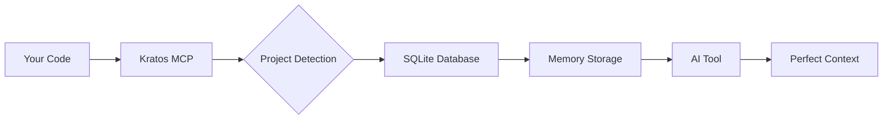

<div align="center">

# 🏛️ Kratos MCP

### Ultra-Lean Memory System for AI Coding Tools

[](https://www.npmjs.com/package/kratos-mcp)
[](https://opensource.org/licenses/MIT)
[](https://modelcontextprotocol.io)
[](https://www.typescriptlang.org/)

**Never explain your codebase again. Let AI remember everything.**

🌐 **[kratos-mcp.com](https://kratos-mcp.com)** • [Installation](#-installation) • [Quick Start](#-quick-start) • [Features](#-features) • [Tools](#-available-tools)

</div>

---

## 🎯 Why Kratos?

After building 30+ production apps with AI, we discovered a critical problem: **AI tools forget everything between sessions**. You explain your architecture, your patterns, your decisions—and tomorrow, you explain it all again.

Kratos MCP solves this with an **ultra-lean memory system** that gives AI perfect recall of your project—with minimal context overhead.

## ✨ Features

<table>
<tr>
<td width="50%">

### 🔒 **100% Project Isolation**
Each project gets its own SQLite database. No cross-contamination. Ever.

</td>
<td width="50%">

### ⚡ **Zero Configuration**
Auto-detects projects via git, package.json, or directory structure. Just install and code.

</td>
</tr>
<tr>
<td width="50%">

### 🪶 **Ultra-Lean Architecture**
Just 12 essential tools. 64% smaller context footprint than competitors.

</td>
<td width="50%">

### 🌍 **Universal Protocol**
Works with Claude, Cursor, Windsurf, Continue—any MCP-compatible tool.

</td>
</tr>
</table>

## 🚀 Installation

```bash
# Install globally
npm install -g kratos-mcp

# Or run directly with npx (no installation required)
npx kratos-mcp

# Or install as a dependency
npm install kratos-mcp
```

## 🎬 Quick Start

### 1️⃣ Configure Your AI Tool

<details>
<summary><b>Claude Desktop</b></summary>

Add to your Claude Desktop config file:
- **macOS**: `~/Library/Application Support/Claude/claude_desktop_config.json`
- **Windows**: `%APPDATA%\Claude\claude_desktop_config.json`
- **Linux**: `~/.config/claude/claude_desktop_config.json`

```json
{
  "mcpServers": {
    "kratos": {
      "command": "npx",
      "args": ["--yes", "kratos-mcp@latest"]
    }
  }
}
```

Or if you have it installed globally:
```json
{
  "mcpServers": {
    "kratos": {
      "command": "kratos-mcp",
      "args": []
    }
  }
}
```
</details>

<details>
<summary><b>Claude Code (Anthropic's VSCode Extension)</b></summary>

Run this command in your terminal:

```bash
claude mcp add kratos -- npx --yes kratos-mcp@latest
```

Or for global installation:

```bash
# First install globally
npm install -g kratos-mcp@latest

# Then add to Claude Code
claude mcp add kratos -- kratos-mcp
```

See [Claude Code MCP docs](https://docs.anthropic.com/claude-code/mcp) for more info.
</details>

<details>
<summary><b>Cursor</b></summary>

Add to `.cursor/mcp_config.json` in your project root:

```json
{
  "mcpServers": {
    "kratos": {
      "command": "npx",
      "args": ["--yes", "kratos-mcp@latest"]
    }
  }
}
```
</details>

<details>
<summary><b>Other MCP Tools</b></summary>

Kratos works with any tool supporting the Model Context Protocol. The general format is:

```json
{
  "command": "npx",
  "args": ["kratos-mcp"]
}
```

**Compatible with:** Windsurf, Cline, BoltAI, Augment Code, Roo Code, Zencoder, Amazon Q, Qodo Gen, JetBrains AI, Warp, Opencode, Continue.dev, Zed, and more!

Check your tool's documentation for specific MCP server configuration location.

</details>

### 2️⃣ Start Using Kratos

```typescript
// Your AI now remembers:
// ✓ Your authentication patterns
// ✓ Your API structure
// ✓ Your component architecture
// ✓ Your coding standards
// ✓ Every decision you've made
```

## 🛠️ Available Tools

Kratos provides **12 ultra-lean tools** optimized for minimal context consumption:

### 💾 Memory Management (7 tools)

<table>
<tr>
<th>Tool</th>
<th>Description</th>
</tr>
<tr>
<td><code>memory_save</code></td>
<td>Store important project knowledge with tags, paths, and importance levels</td>
</tr>
<tr>
<td><code>memory_search</code></td>
<td>Smart semantic search with debug mode and path matching</td>
</tr>
<tr>
<td><code>memory_ask</code></td>
<td>Natural language queries about your memories</td>
</tr>
<tr>
<td><code>memory_get_recent</code></td>
<td>Get recently created memories with filtering</td>
</tr>
<tr>
<td><code>memory_get</code></td>
<td>Retrieve a specific memory by ID</td>
</tr>
<tr>
<td><code>memory_get_multiple</code></td>
<td>Bulk retrieve multiple memories</td>
</tr>
<tr>
<td><code>memory_forget</code></td>
<td>Delete a memory by ID</td>
</tr>
</table>

### 🔒 Security (1 tool)

<table>
<tr>
<th>Tool</th>
<th>Description</th>
</tr>
<tr>
<td><code>security_scan</code></td>
<td>Scan text for PII and secrets before saving</td>
</tr>
</table>

### 📁 Project Management (3 tools)

<table>
<tr>
<th>Tool</th>
<th>Description</th>
</tr>
<tr>
<td><code>project_switch</code></td>
<td>Switch between different projects</td>
</tr>
<tr>
<td><code>project_current</code></td>
<td>Get current active project info</td>
</tr>
<tr>
<td><code>change_storage_path</code></td>
<td>Dynamically change storage location with automatic data migration</td>
</tr>
</table>

### ⚙️ System (1 tool)

<table>
<tr>
<th>Tool</th>
<th>Description</th>
</tr>
<tr>
<td><code>system_status</code></td>
<td>Get system status and memory statistics</td>
</tr>
</table>

## 📊 How It Works



## 🔬 Under the Hood

- **SQLite + FTS5**: Lightning-fast full-text search
- **Smart Scoring**: Path matching + recency + importance
- **Auto-detection**: Git, package.json, or directory-based
- **Secure**: All data stays local, no external calls
- **Lean**: Only 4 core components, minimal memory footprint

## 📈 Performance

<table>
<tr>
<th>Metric</th>
<th>Value</th>
</tr>
<tr>
<td>Context Overhead</td>
<td>64% smaller than v3</td>
</tr>
<tr>
<td>Memory Retrieval</td>
<td>&lt; 10ms</td>
</tr>
<tr>
<td>Project Switch</td>
<td>&lt; 100ms</td>
</tr>
<tr>
<td>Storage Overhead</td>
<td>~2MB per project</td>
</tr>
</table>

## 🗂️ Memory Structure

```
~/.kratos/                       # Default storage location
├── projects/
│   ├── project-id-1/
│   │   └── memories.db          # SQLite database with FTS5
│   └── project-id-2/
│       └── memories.db
└── global/
    └── global.db                # Shared knowledge (optional)
```

**New in v1.6.1:** Use `change_storage_path` to move data to custom locations like `/opt/kratos` or `.kratos` for per-project storage.

## 💡 Example Usage

```typescript
// Save a memory
await memory_save({
  summary: "JWT auth implementation",
  text: "We use httpOnly cookies with refresh tokens...",
  tags: ["auth", "security"],
  paths: ["src/middleware/auth.ts"],
  importance: 5
});

// Search memories
await memory_search({
  q: "authentication",
  k: 5,
  debug: true  // Get search insights
});

// Ask natural language questions
await memory_ask({
  question: "How does our auth system work?",
  limit: 10
});

// Change storage location
await change_storage_path({
  newPath: "/opt/kratos",
  migrate: true,
  backup: true
});
```

## 🎮 Live Demo

```typescript
// User: "Explain the auth system"
//
// Kratos automatically retrieves:
// ✓ JWT implementation from 2 weeks ago
// ✓ Middleware configuration from last month
// ✓ User model structure from initial setup
//
// AI Response: "Your auth uses JWT with refresh tokens
// stored in httpOnly cookies. The middleware validates
// tokens on protected routes at /api/middleware/auth.ts:42..."
```

## 🤝 Contributing

We welcome contributions! See [CONTRIBUTING.md](CONTRIBUTING.md) for guidelines.

```bash
# Clone the repo
git clone https://github.com/ceorkm/kratos-mcp.git

# Install dependencies
npm install

# Build
npm run build

# Run in development
npm run dev
```

## 📄 License

MIT © 2025 Kratos MCP Contributors

## 🙏 Acknowledgments

Built on the [Model Context Protocol](https://modelcontextprotocol.io) by Anthropic.

Inspired by real-world experience building production apps with AI.

---

<div align="center">

**Built for developers who value their time.**

[Report Bug](https://github.com/ceorkm/kratos-mcp/issues) • [Request Feature](https://github.com/ceorkm/kratos-mcp/issues) • [Documentation](https://github.com/ceorkm/kratos-mcp#readme)

</div>
